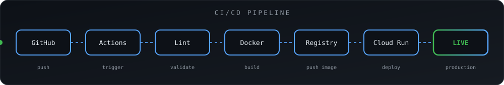

<div align="center">


<br/>


<br/><br/>

<a href="https://www.linkedin.com/in/jothilingam-s"></a>
<a href="https://sjitsolutions.in"></a>


</div>

---

## 👨‍💻 About Me

```yaml
name:      Jothilingam S
role:      Cloud & DevOps-focused IT Graduate
focus:     [AWS, Google Cloud, Docker, CI/CD, Linux]
building:  Production deployments & automated pipelines
approach:  Automate everything, monitor everything
status:    Open to work - immediate joiner
```

I work across **application development, cloud infrastructure, deployment automation, troubleshooting and performance optimization** - taking projects from a local commit to a live, monitored production service.

---

## 🛠️ Tech Stack

<div align="center">


</div>

---

## ☁️ Cloud & DevOps Toolkit

<div align="center">

| Category | Technologies |
|:---|:---|
| ☁️ **Cloud** | `AWS` · `Google Cloud` |
| ⚙️ **Compute** | `EC2` · `Cloud Run` |
| 🗄️ **Storage & DB** | `S3` · `RDS` · `MySQL` · `PostgreSQL` |
| 🌐 **Networking** | `VPC` · `Subnets` · `Route Tables` · `Internet Gateway` · `NAT Gateway` · `Route 53` |
| 🔐 **Security** | `IAM` · `Security Groups` · `NACLs` · `Access Policies` |
| 📈 **Monitoring** | `CloudWatch` |
| 📦 **Containers** | `Docker` |
| 🔁 **CI/CD** | `GitHub Actions` |
| 🖥️ **Servers** | `Linux` · `Nginx` |
| 🤖 **Automation** | `Bash` · `AWS CLI` |
| 💻 **Development** | `React` · `JavaScript` · `Python` · `REST APIs` |

</div>

---

## 🚀 CI/CD Pipeline

<div align="center">



</div>

---

## 📊 GitHub Stats

<div align="center">


<br/>


<br/>


</div>

---

<div align="center">

### 💬 Let's build something reliable

<a href="https://www.linkedin.com/in/jothilingam-s"></a>


</div>
